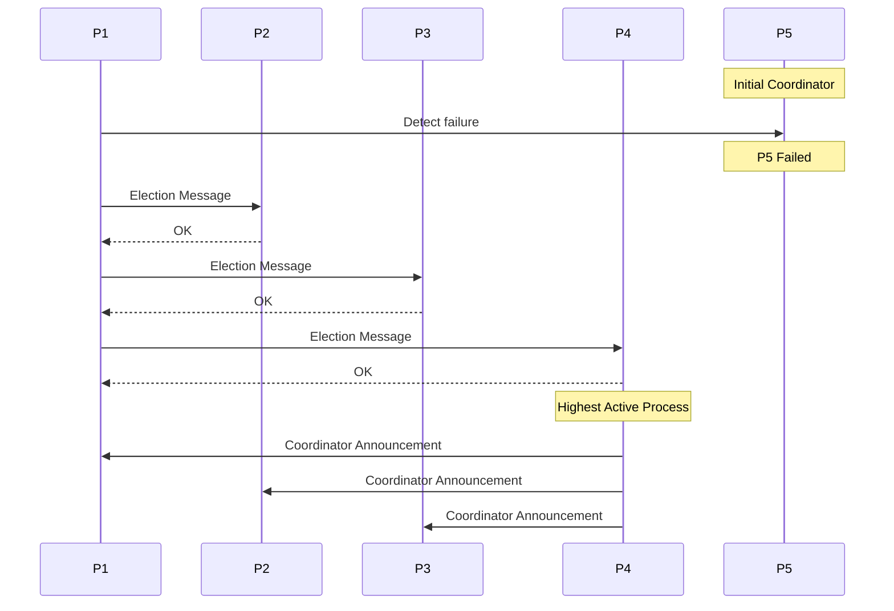
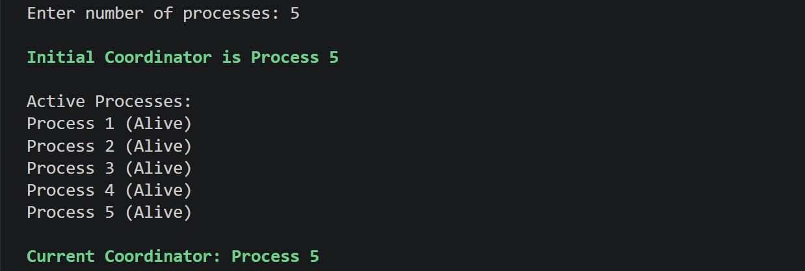
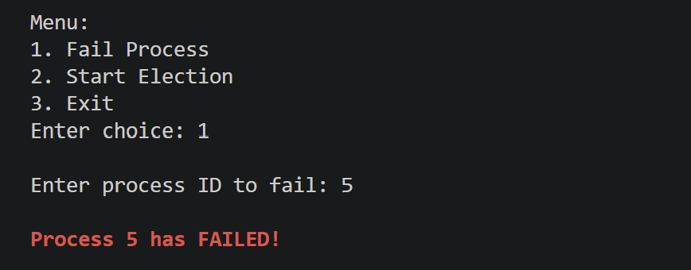
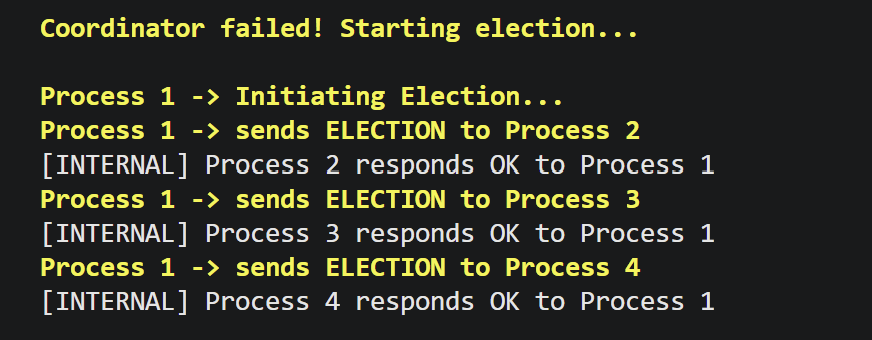
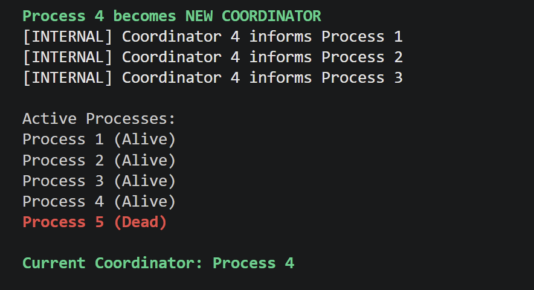
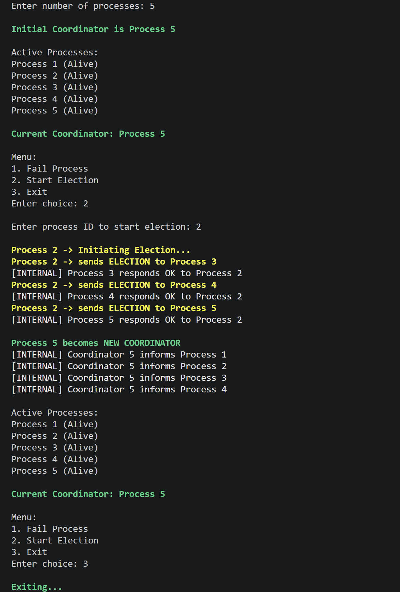

<h1 align="center">Bully Election Algorithm</h1>
<h3 align="center">DCC LCA-2</h3>
<p align="center">
  
</p>

---
- **Name:** Manasvi Deshmukh  
- **PRN:** 1032222834
- **Subject:** DCC (Distributed Computing Concepts)  
 

---

## Task Description
### Bully Election Algorithm
- Implement the algorithm using C  
- Simulate process failure and election  

---

## Overview

The **Bully Election Algorithm** is a leader election algorithm used in distributed systems. It ensures that when a coordinator (leader) fails, a new coordinator is elected among the remaining active processes.

The process with the **highest ID** is always selected as the coordinator.

---

## Key Concepts

- Each process has a **unique ID**
- Higher ID ⇒ Higher priority
- If coordinator fails:
  - Lower processes initiate election
  - Highest active process becomes coordinator

---

## Algorithm (Step-by-Step)

1. A process detects that the coordinator has failed  
2. It sends an **ELECTION message** to all higher-ID processes  
3. If no response is received:
   - It becomes the coordinator  
4. If higher processes respond:
   - They take over the election process  
5. The highest active process:
   - Declares itself as the new coordinator  
6. It sends a **COORDINATOR message** to all processes  

---

## Working Explanation

- Initially, all processes are active  
- The process with the highest ID is the coordinator  
- When a process fails:
  - If it is the coordinator → election is triggered  
  - Otherwise → no election required  
- During election:
  - Messages are passed to higher processes  
  - Internal responses simulate distributed communication  
- Final result:
  - New coordinator is elected dynamically  

---

## Implementation Details

- **Language Used:** C  

- **Approach:**
  - Dynamic process creation
  - Menu-driven simulation

---

## Bully Election Process Flow


---
## Features Implemented

- Dynamic number of processes  
- Process failure simulation  
- Manual election triggering  
- Automatic election on coordinator failure  
 

---

## Requirements

- **Operating System:** Windows / Linux  
- **Compiler:** GCC (MinGW for Windows)  
- **IDE:** VS Code (recommended)  

---
## Steps to Run

### 1. Compile the Code
```bash
gcc bully.c -o bully
```
### 2. Run the Program
```bash
./bully
```
---
## Menu Options

1. Fail Process  
2. Start Election  
3. Exit  

---

## Sample Execution

### Case 1: Coordinator Failure

- Coordinator process is terminated  
- Election is triggered automatically  
- New coordinator is selected  

---

### Case 2: Manual Election

- Election started manually by a process  
- Higher processes respond  
- Highest active process becomes coordinator  

---

## Screenshots

##### Initial process state 
  

##### Process failure simulation
    

##### Election process logs
    

##### New coordinator selection
    

##### Manual election execution
    

---

## Conclusion

The Bully Election Algorithm was successfully implemented and simulated using C. The system dynamically handles process failures and ensures correct election of a new coordinator. 

---

## Learning Outcomes

- Understanding of distributed leader election  
- Simulation of process communication  
- Handling failure scenarios  
- Implementation of algorithmic logic in C  


