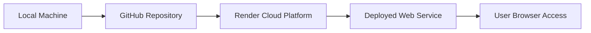
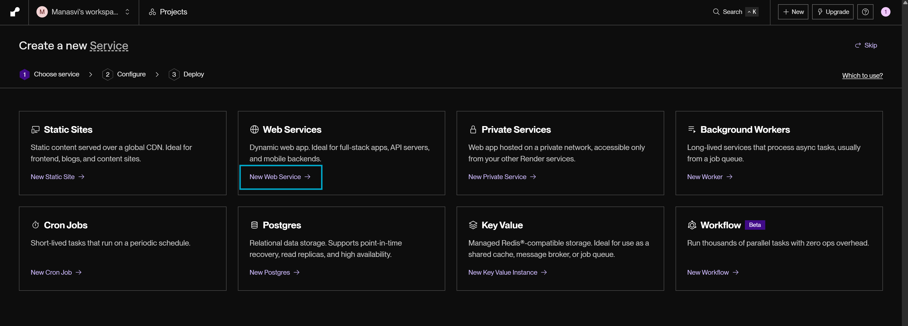
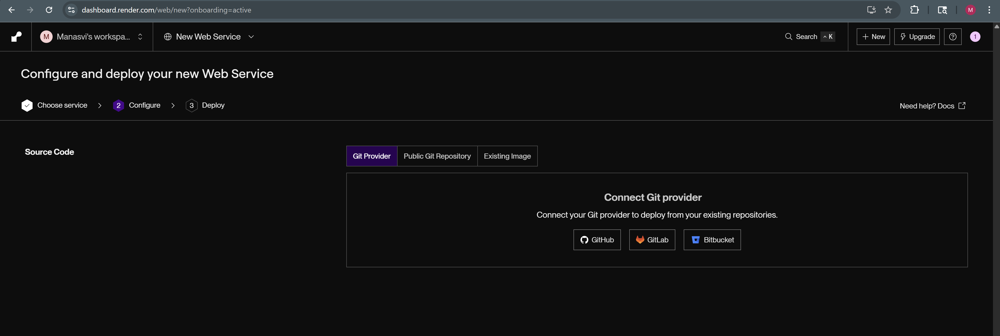
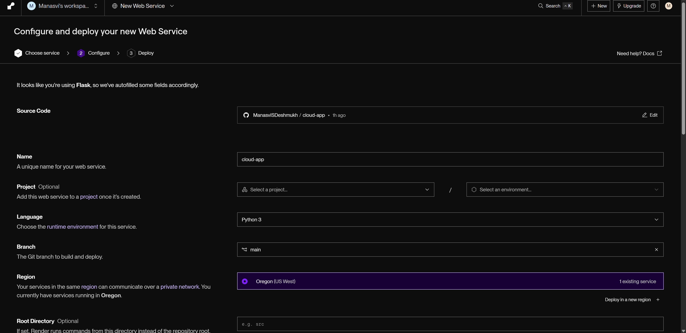
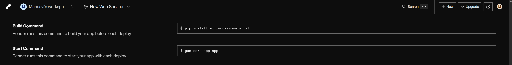
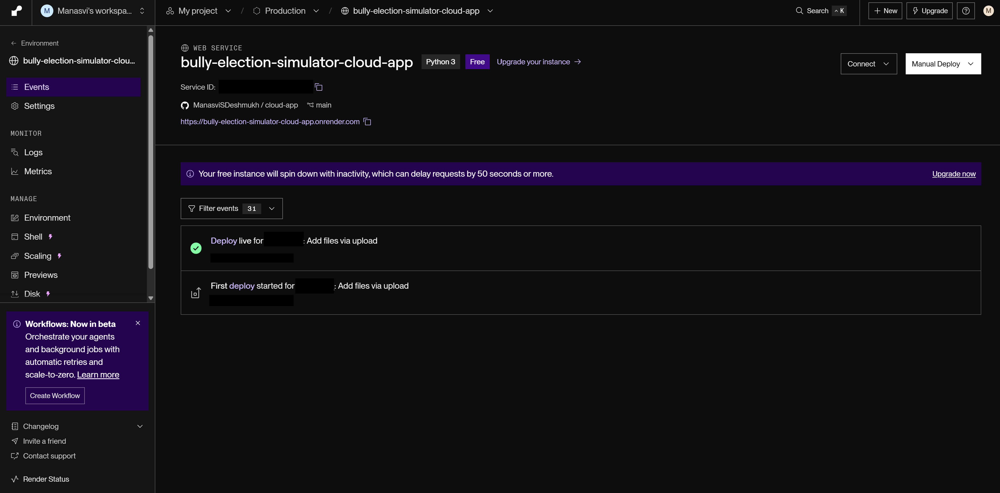
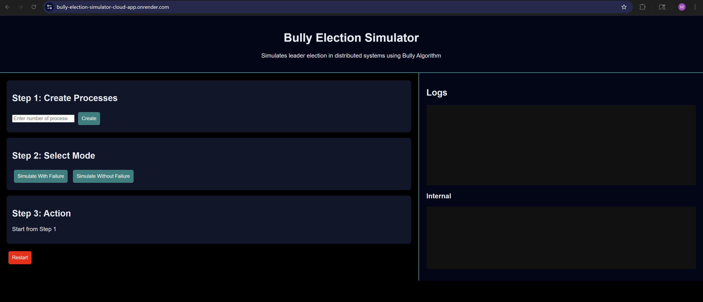
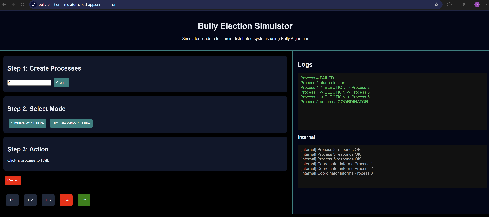
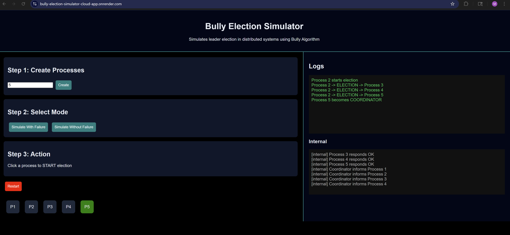

<h1 align="center">Cloud Application Deployment</h1>
<h3 align="center">DCC LCA-2</h3>

<p align="center">
  
</p>

---

- **Name:** Manasvi Deshmukh  
- **PRN:** 1032222834  
- **Subject:** DCC (Distributed Computing Concepts)  

---

## Task Description

### Cloud Computing Basics
- Deploy a simple application using Cloud  
- Demonstrate working through browser  

---

## Live Deployment

🔗 **Application URL:**  
`https://bully-election-simulator-cloud-app.onrender.com`  

> The application is deployed on cloud and accessible via browser.

---

## Overview

Cloud computing enables applications to be deployed and accessed over the internet without relying on local infrastructure. In this task, a distributed system simulator application is deployed on a cloud platform.

The application demonstrates **Bully election logic** and is made accessible through a public URL.

---

## Cloud Platform Used

- **Platform:** Render  
- **Service Type:** Web Service (PaaS)

---

## Application Summary

A **Bully Election Simulator** web application was deployed, which:
- Simulates distributed processes  
- Demonstrates leader election  
- Allows failure and election scenarios  
- Displays logs and internal communication  

---

## Cloud Architecture


---
## Deployment Workflow

### Step 1: Prepare Application

- Create Flask application  
- Add required files:
  - `app.py`
  - `requirements.txt`
  - Templates & static files  


### Step 2: Create `requirements.txt`

- Add required dependencies for deployment

```bash
flask
gunicorn
```

### Step 3: Push Code to GitHub
```bash
git init
git add .
git commit -m "cloud deployment"
git branch -M main
git remote add origin <repository-link>
git push -u origin main
```
Note: Repository was kept private for security.

### Step 4: Deploy on Render

1. Login to Render  
2. Click **New → Web Service**  

3. Connect your GitHub repository  

4. Configure your service


#### Configuration

| Setting        | Value                          |
|---------------|--------------------------------|
| Build Command | `pip install -r requirements.txt` |
| Start Command | `gunicorn app:app`             |



### Step 5: Automatic Deployment

- Render installs dependencies  
- Builds the application  
- Deploys the web service automatically  



### Step 6: Access Application

After deployment, a live URL is generated:
`https://your-app-name.onrender.com`

---
## Features of Deployment

- Hosted on cloud infrastructure  
- Accessible globally via browser  
- Automatic build and deployment  
- No local setup required for users  

---

## Cloud Application Screenshots 

##### Running Application (Browser)


##### Bully Election Simulation with Process Failure


##### Bully Election Simulation without Process Failure


---

## Security Considerations

- GitHub repository set to **Private**  
- Controlled access via authorized deployment  
- No sensitive data exposed  

---

## Conclusion

The cloud deployment of the distributed system simulator was successfully completed using Render. The application is accessible via a browser at `https://bully-election-simulator-cloud-app.onrender.com`  and demonstrates practical implementation of bully election algorithm.

---

## Learning Outcomes

- Understanding cloud deployment workflow  
- Integration of GitHub with cloud platforms  
- Hands-on experience with PaaS services  
- Hosting and accessing applications over the internet  

