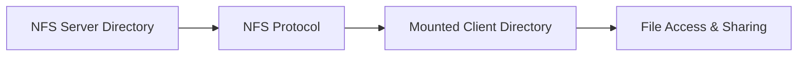

<h1 align="center">Network File System (NFS)</h1>
<h3 align="center">DCC LCA-2</h3>

<p align="center">
  
</p>

---

- **Name:** Manasvi Deshmukh  
- **PRN:** 1032222834  
- **Subject:** DCC (Distributed Computing Concepts)  

---

## Task Description

### Network File System (NFS)
- Configure NFS server and client  
- Mount shared directory and verify access  

---

## Overview

The **Network File System (NFS)** is a distributed file system protocol that allows a client to access files over a network as if they were stored locally.

In this task, an NFS server and client are configured on the same system using WSL (Ubuntu), and file sharing is demonstrated between them.

---

## System Architecture


---
## Environment Used

- Operating System: Windows (WSL - Ubuntu)
- Server: NFS Kernel Server
- Client: NFS Common
- Terminal: Ubuntu (WSL)

---
## Implementation Steps

### Step 1: Install NFS Server and Client
```bash
sudo apt update
sudo apt install nfs-kernel-server -y
sudo apt install nfs-common -y
```


### Step 2: Create Shared Directory (Server)
```bash
mkdir ~/nfs_shared
chmod 777 ~/nfs_shared
echo "Hello from Server" > ~/nfs_shared/test.txt
```


### Step 3: Configure NFS Exports
- Open exports file:
```bash
sudo nano /etc/exports
```
- Add:
```bash
/home/your-username/nfs_shared *(rw,sync,no_subtree_check,no_root_squash)
```
- Apply configuration:
```bash
sudo exportfs -a
sudo systemctl restart nfs-kernel-server
```


### Step 4: Create Client Mount Directory
```bash
mkdir ~/nfs_client
```


### Step 5: Mount Shared Directory (Client)
```bash
sudo mount -t nfs localhost:/home/your-username/nfs_shared ~/nfs_client
```


### Step 6: Verify Access
- List files:
```bash
ls ~/nfs_client
```


### Step 7: Test File Sharing
- Create file from client:
```bash
echo "Hello from Client" > ~/nfs_client/client.txt
```
- Verify on server:
```bash
ls ~/nfs_shared
```


---
## Conclusion

The NFS server and client were successfully configured using Ubuntu (WSL). The shared directory was mounted on the client, and file operations were verified, demonstrating seamless file sharing over a network.

---

## Learning Outcomes

- Understanding distributed file systems
- Configuring NFS server and client
- Mounting remote directories
- Verifying real-time file sharing
